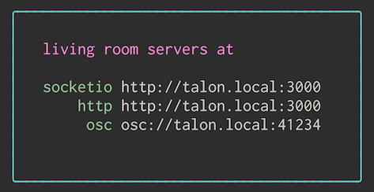

# service-js

Creates a living room that you can connect to over HTTP, socket.io, and osc!

You can test it out by running `npm start` after installing the dependencies with `npm install`



For motivations, context, and philosophy, check out https://github.com/living-room/living-room

For a nice javascript client, check out https://github.com/living-room/client-js

## installing

There is a git [post-receive hook](./hooks/post-receive) which we setup like so:

    # on remote machine
    git clone --bare https://github.com/living-room/service-js.git service-js.git
    mkdir service-js
    # on local machine
    git remote add my-remote-machine ssh://my-remote-machine/home/livingroom/service-js.git

After deploying the default branch, the post-receive hook checks it out and restarts the system service. neat.

## example http

    $ curl -d 'facts=curl is an app at (20, 30)' localhost:3000/assert
    OK

    $ curl -d 'facts=$who is an app at ($x, $y)' localhost:3000/select
    {"assertions":[{"who":{"word":"curl"},"x":{"value":20},"y":{"value":30}}]}%

## example socket.io

    npm run serve:examples && open http://localhost:5000

from [examples/browser.html](examples/browser.html)

```javascript
const socket = io.connect(`http://localhost:3000`)

// The pattern we want to match on
const pattern = 'ping $number'

let pong = 0

// To subscribe pass in the JSON of an array of patterns
const patternsString = JSON.stringify([pattern])

// We will get back an object, we just care about new assertions
socket.on(patternsString, ({assertions}) => {
  assertions.forEach(({number}) => {
    const value = parseInt(number.value)
    if (value > pong) pong = value
    console.log(`<- pong ${pong}`)
    pong++
  })
})
socket.emit('subscribe', patternsString)

// Start pinging from highest previous ping
setInterval(() => {
  socket.emit('assert', `ping ${pong}`, data => {
    console.log(`-> ${data[0]}`)
  })
}, 1500)
```

## example opensoundcontrol

from [examples/osc/osc.pde](examples/osc/osc.pde)

```processing
/**
 * based off of oscP5message by andreas schlegel
 * oscP5 website at http://www.sojamo.de/oscP5
 */

import oscP5.*;
import netP5.*;

OscP5 oscP5;
NetAddress myRemoteLocation;

void setup() {
  size(400,400);
  frameRate(25);
  oscP5 = new OscP5(this, 12000);

  myRemoteLocation = new NetAddress("127.0.0.1",41234);
}


void draw() {
  background(0);
}

void mousePressed() {
  OscMessage assertMessage = new OscMessage("/assert");
  assertMessage.add("processing is a program at (0.2, 0.3)");
  oscP5.send(assertMessage, myRemoteLocation);

  OscMessage assert2Message = new OscMessage("/assert");
  assert2Message.add("coolprocessing is a notherprogram at (0.4, 0.4)");
  oscP5.send(assert2Message, myRemoteLocation);

  OscMessage selectMessage = new OscMessage("/select");
  selectMessage.add("$name is a $type at ($x, $y)");
  oscP5.send(selectMessage, myRemoteLocation);
}
```
